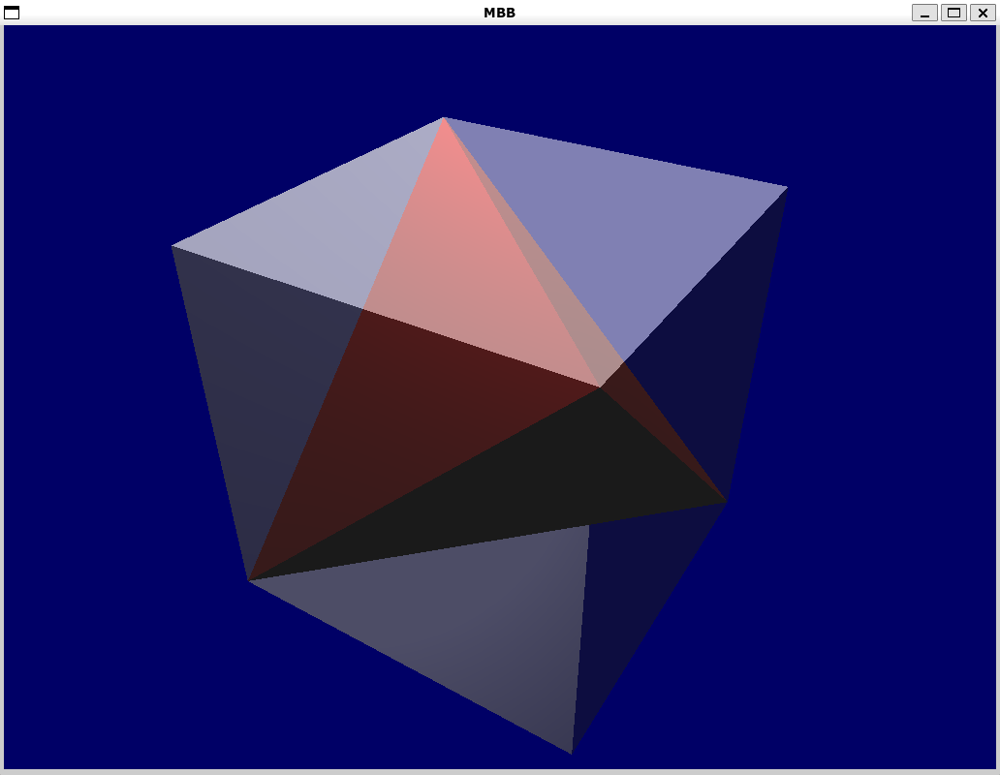
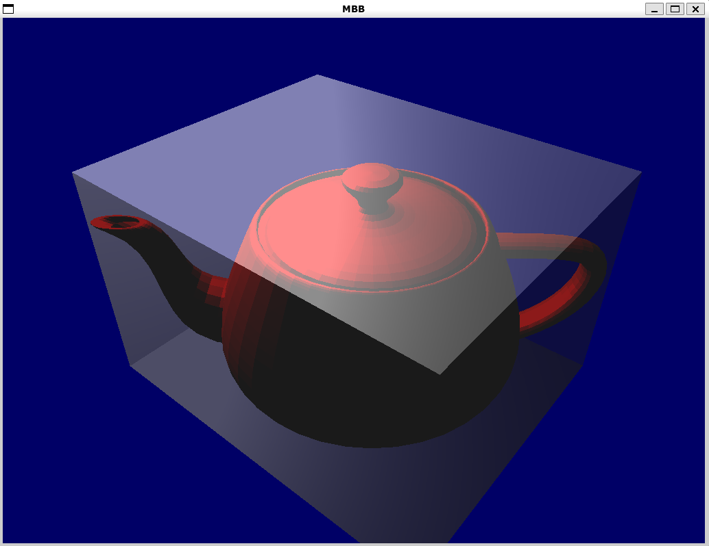

# Minimum bounding box approximation

  
  

## Running the program on Linux

### Requirements
GLEW (The OpenGL Extension Wrangler Library) 
* run `sudo apt-get install libglew-dev`

GLFW (Graphics Library Framework)
* run `sudo apt-get install libglfw3`

If you get a message saying any of these libraries cannot be located,
run `sudo apt-get update` to update your package lists

### Running
Navigate to the directory where you have extracted the executable 
and run it with the path to an `.obj` file as the only argument, e.g.
* `./Minimum_bounding_box tertahedron.obj`

Note that the executable needs to be located in the same folder as 
the shaders directory, otherwise it won't work.

## Building on Linux 

### Without CMake
In addition to packages above, install `g++`, `libglfw3-dev`, and 
`libglm-dev`. 

Navigate to source root folder and run
* `g++ *.cpp -I ./utility/ utility/*.cpp -lGLEW -lglfw -lGL -std=c++17 -O1 -o Minimum_bounding_box`

### Using CMake
Install the `cmake` package.

Navigate to source root folder and run 
* `cmake -B ./build` 

This may produce errors because CMake cache doesn't exist. If this happens, run the command again.

After this, run
* `make --directory=build`

You should now see a message that the build was successful.

